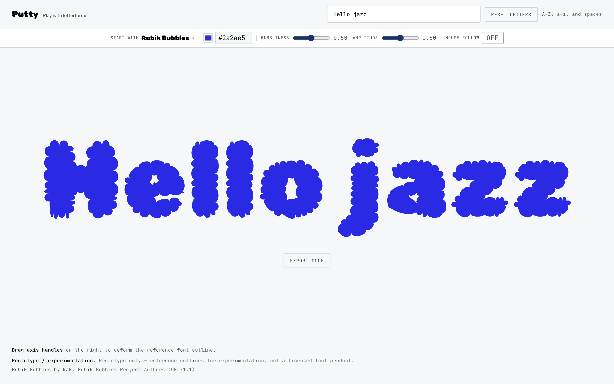
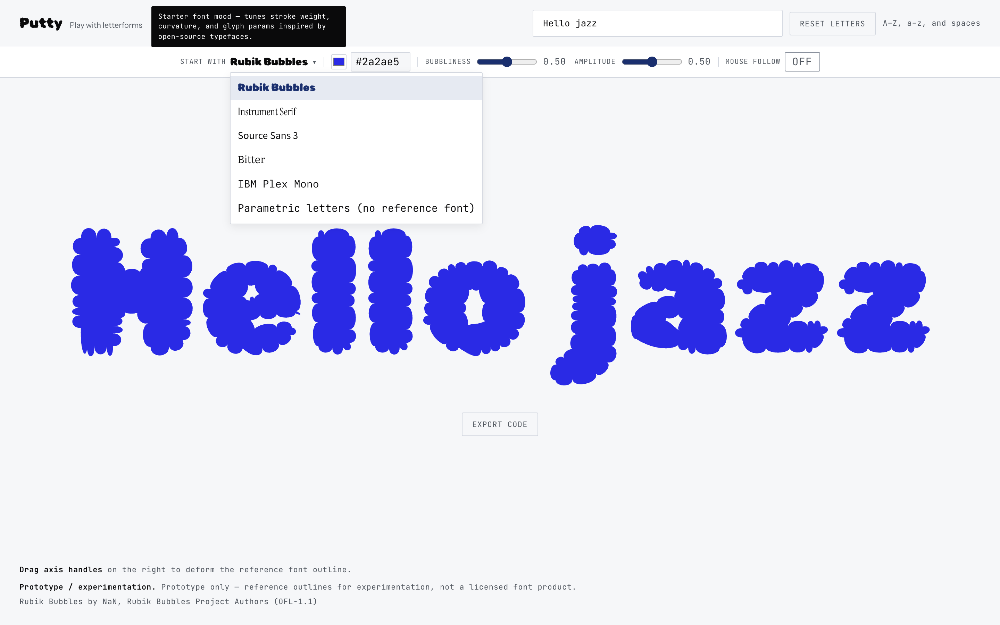
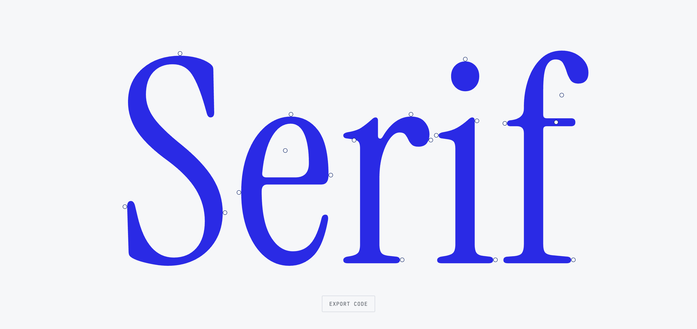
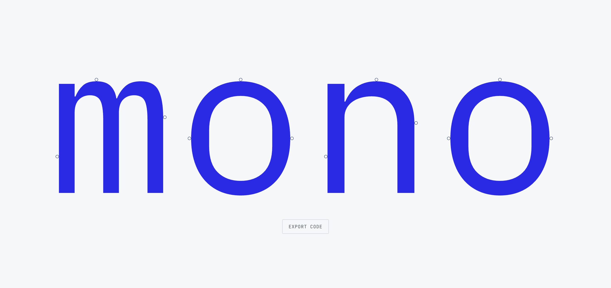
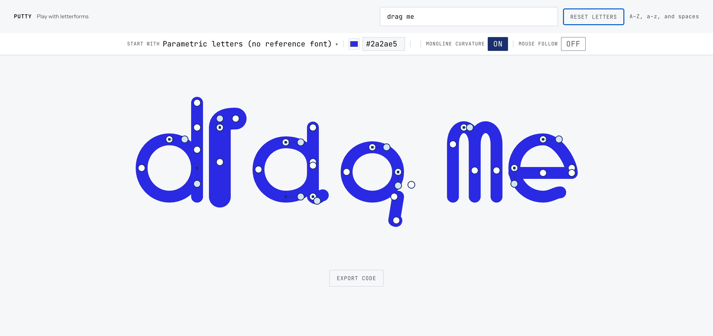
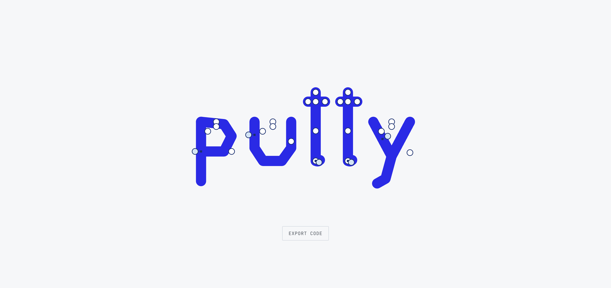
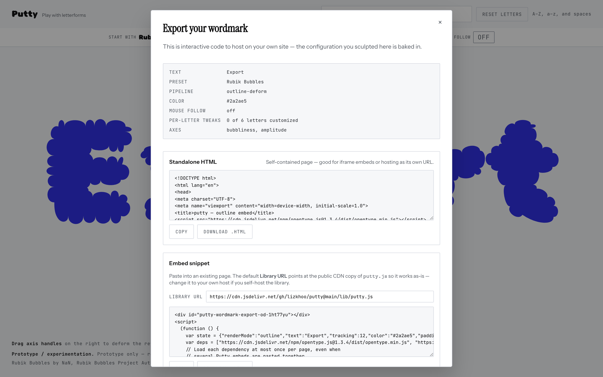

# Putty

A small JavaScript library for playing with letterforms, plus a demo site built on top of it. Pick one of five open-source reference fonts (or fully parametric letters), drag the handles, watch the wordmark respond — then embed the library yourself or export a self-contained interactive bundle.



## Run it

```bash
git clone https://github.com/lizkhoo/putty.git
cd putty
npm install
npm run dev
# open the printed URL, e.g. http://127.0.0.1:5173/index.html
```

> If port `5173` is already taken, start Vite on another port — `npm run dev -- --port 5174` — and open that one instead.

One library file (`lib/putty.js`) plus a demo page (`index.html`) that doubles as in-page developer docs. No build step beyond Vite.

## What it does

### 1. Pick a starting point

Choose a starting font “mood” from the picker — `Rubik Bubbles`, `Instrument Serif`, `Source Sans 3`, `Bitter`, `IBM Plex Mono`, or `Parametric letters` (no reference font). Each preset seeds stroke weight, curvature, and per-glyph parameters.



### 2. Type a word

Enter any word (A–Z, a–z, and spaces). The wordmark re-renders live, with draggable handles on every glyph.

| Instrument Serif | IBM Plex Mono |
| :---: | :---: |
|  |  |

### 3. Drag the handles

Grab any handle to reshape that letter’s anatomy. In parametric mode, circles with arms are curve controls and filled circles are positional anchors — pull them to stretch, bend, and warp each glyph.



Pure parametric letters (no reference font) expose the full handle set:



### 4. Export code

Hit **Export code** to download a self-contained interactive HTML bundle, or copy an embed snippet that loads the library from a CDN. The configuration you sculpted — preset, color, per-letter tweaks, and axes — is baked in.



## Regenerating the screenshots

The images above live in [`docs/screenshots/`](docs/screenshots/) and are produced by the scripts in [`scripts/`](scripts/), which drive the running demo with Playwright (using your installed Google Chrome):

```bash
npm run dev -- --port 5174       # in one terminal
node scripts/shoot.mjs           # captures the preset / picker / export shots
node scripts/shoot-drag.mjs      # captures the drag-to-deform shot
```

## License & attribution

The library and demo are this repository's own code, released under the [MIT License](LICENSE). Reference font outlines are loaded at runtime from open-source faces under SIL OFL 1.1 — see [`docs/THIRD_PARTY_FONTS.md`](docs/THIRD_PARTY_FONTS.md) for full attribution. **Prototype use only**; do not redistribute exported outlines as a substitute for licensing the original fonts.
